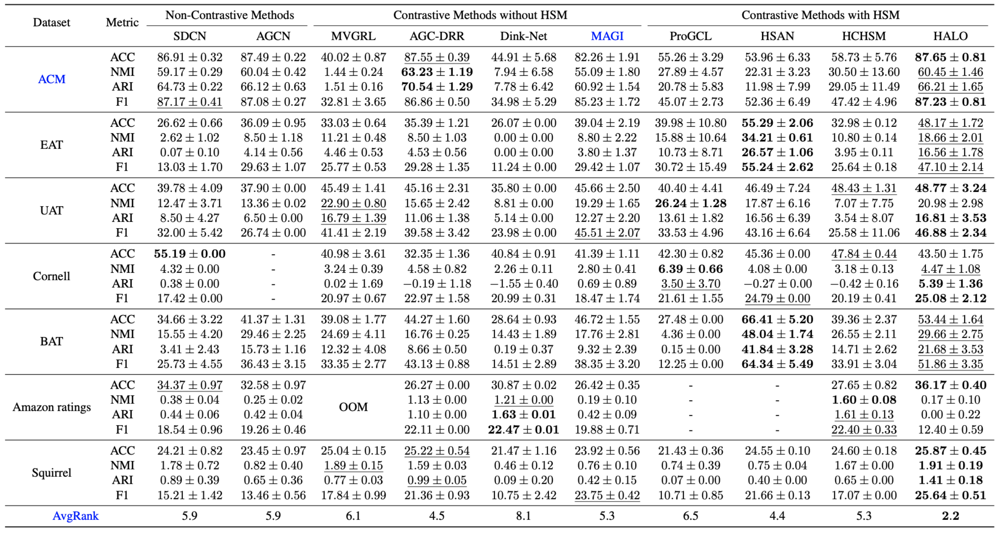
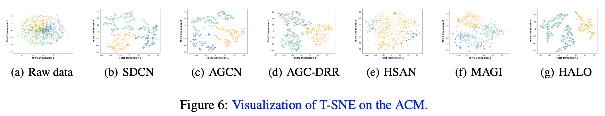
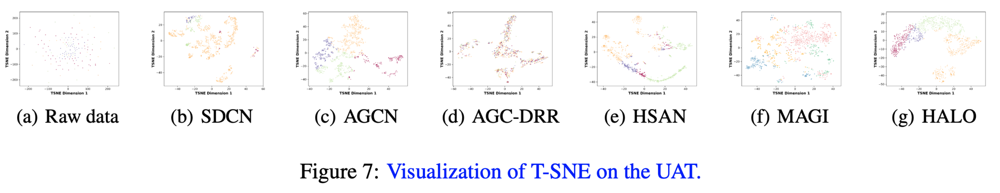
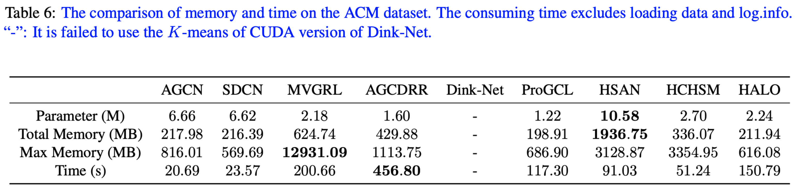

# HALO


## Experiments









## Preparation
**Dependency**

* Python == 3.8.8

* cuda == 11.0

* torch == 1.7.1

* numpy == 1.24.3

* scikit-learn == 1.3.0

* munkres == 1.1.4
  
**Data**

INPUT: attributes, adj, labels 

* ACM, EAT, UAT, BAT, and Cornell: can be found in [(Awesome Deep Graph Clustering)](https://github.com/yueliu1999/Awesome-Deep-Graph-Clustering).

* Squirrel and Amazon ratings: can be found in [(Yandex Research)](https://github.com/yandex-research/heterophilous-graphs/tree/main/data).


## Usage
We provide a version for all platforms (MacOS, Win, and Linux).

```bash
CUDA_VISIBLE_DEVICES=0 python main.py -d acm
```

## Acknowledgement
We thank for their open sources of [(Awesome Deep Graph Clustering)](https://github.com/yueliu1999/Awesome-Deep-Graph-Clustering) that contributes a lot to this community.
The [(SwAV)](https://github.com/facebookresearch/swav) is also in our favour.


